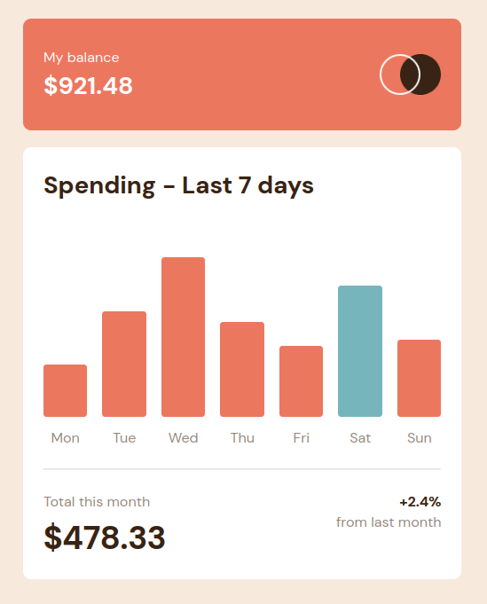

# Frontend Mentor - Expenses chart component solution

This is a solution to the [Expenses chart component challenge on Frontend Mentor](https://www.frontendmentor.io/challenges/expenses-chart-component-e7yJBUdjwt). Frontend Mentor challenges help you improve your coding skills by building realistic projects. 

## Table of contents

- [Overview](#overview)
  - [The challenge](#the-challenge)
  - [Screenshot](#screenshot)
  - [Links](#links)
- [My process](#my-process)
  - [Built with](#built-with)
  - [What I learned](#what-i-learned)
  - [Continued development](#continued-development)
  - [Useful resources](#useful-resources)
- [Author](#author)

## Overview

### The challenge

Users should be able to:

- View the bar chart and hover over the individual bars to see the correct amounts for each day
- See the current day’s bar highlighted in a different colour to the other bars
- View the optimal layout for the content depending on their device’s screen size
- See hover states for all interactive elements on the page
- **Bonus**: Use the JSON data file provided to dynamically size the bars on the chart

### Screenshot



### Links

- Live Site URL: [Hosted on github pages](#)

## My process

### Built with

- Semantic HTML5 markup
- Flexbox
- Mobile-first workflow
- [React](https://reactjs.org/) - JS library

### What I learned

I learnt many things throughout the development of this component, but I'll only share a small snippet here.

I learnt how to detect and change states within a component by using the `useState()` function.

```js
const [isHovered, setIsHovered] = useState(false); // used to display the amount spent on a particular day

return (
        <div className="Bar">
            <div 
                className="Amount"
                id={`bar-${day.toLowerCase()}`} 
                style={{ 
                    height: `${amount*3}px`,
                    backgroundColor: isToday ? 'hsl(186, 34%, 60%)': 'hsl(10, 79%, 65%)'
                }}
                // handling hovering
                onMouseEnter={() => setIsHovered(true)} 
                onMouseLeave={() => setIsHovered(false)}
            ></div>
            {/* Handling JSON data */}
            <p key={day}>{day}</p> 
            {isHovered && (
                <div className='Hover-amount'>
                    <p key={amount}>${amount}</p>
                </div>
            )}
        </div>
    )
```

This meant that I could change the states of each individual `Bar` component and display its amount above it.

### Continued development

I want to get more familiar with React!

### Useful resources

- [React website](https://react.dev/) - Helped me understand react functions
- [W3schools](https://www.w3schools.com/css/) - Helped me with styling certain elements
- [MDN web docs](https://developer.mozilla.org/en-US/) - Great general reference
- [Sitepoint blogs](https://www.sitepoint.com/javascript/) - explained JavaScript concepts really well

## Author

- Frontend Mentor - [@SushiOnToast](https://www.frontendmentor.io/profile/SushiOnToast)
- CodePen - [@SushiOnToast](https://codepen.io/SushiOnToast)
- CodeWars - [@SushiOnToast](https://www.codewars.com/users/SushiOnToast)